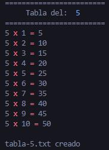

<h1 align="center">Tabla De Multiplicar</h1>

     

<p align="center">
    
    
      
         
</p>

<p align="center">
  <a href="https://es.wikipedia.org/wiki/Interfaz_de_l%C3%ADnea_de_comandos">
    CLI
  </a>
  que proporciona una solución versátil para generar tablas de multiplicar.
</p>

## Características

- 💫 Genera la tabla de multiplicar usando JavaScript.
- 🧷 Procesa eficientemente los argumentos de la línea de comandos.
- 🏗️ Formatea el resultado con colores.
- 📝 Escribe el resultado en un archivo de texto personalizado y retorna el nombre del propio archivo generado.

# Inicio del Proyecto

## Requisito previo

- Tener configurado un entorno con `Node.js` para instalar las dependencias necesarias.

> [!TIP]
> Bun es una alternativa moderna y eficiente a npm y yarn para la gestión de paquetes en proyectos javascript.
>
> ```shell
>   curl -fsSL https://bun.sh/install | bash
> ```

## Instalación

- Abre tu terminal o línea de comandos.
- Navega hasta el directorio donde se encuentra el proyecto.
- Ejecuta el siguiente comando para instalar las dependencias.

```shell
  bun install
```

> Si estás utilizando herramientas de gestión de paquetes como `yarn` o `npm` sustituirlo por `bun`.

### Run

- En el directorio donde se encuentra el proyecto ejecuta el siguiente comando para levantarlo.

> - Si tu gestor de paquetes es `yarn` o `npm` sustituirlo por `bun`.

```shell
  bun dev
```

### Creditos

  <a href="https://github.com/Klerith/Klerith">
    Fernando Herrera
  </a>
  <h4 align="right">

  <a  align="right" href="https://github.com/Klerith/Klerith">
    ihasashi
  </a>
</h4>
